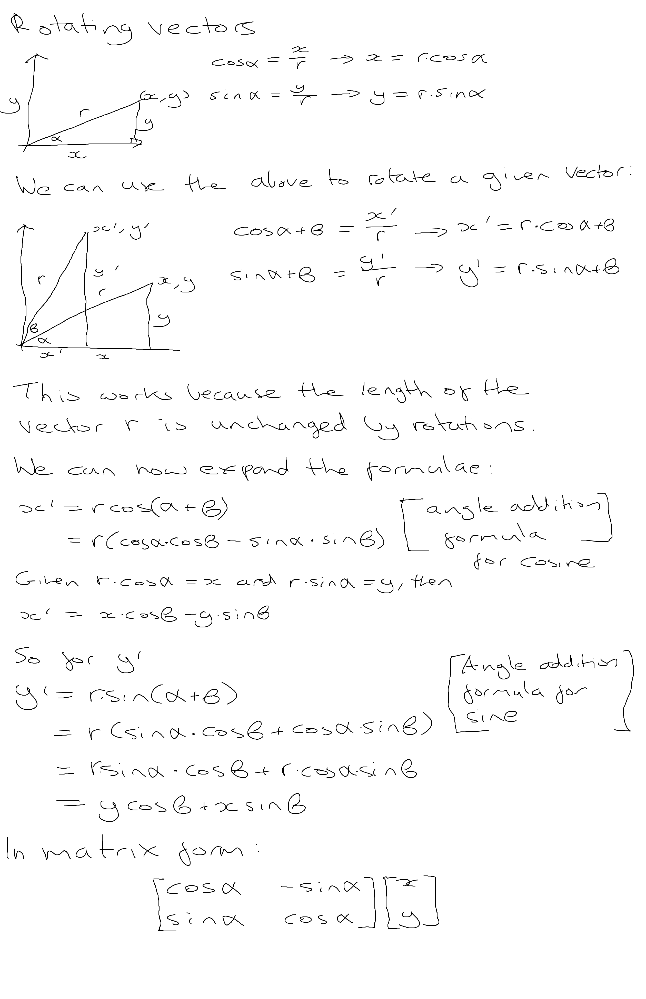

# Course Notes

## Notes

## Formulae

### Rotation of a vector

Given that:

$$
cos(\alpha) = \dfrac{x}{r}
$$

$$
\therefore x = r \cdot cos(\alpha)
$$

And:

$$
sin(\alpha) = \dfrac{y}{r}
$$

$$
\therefore y = r \cdot sin(\alpha)
$$

then rotating a vector $[x, y]$ from angle $\alpha$ to angle $\beta$ yields the following transformed vector $[x^\prime, y^\prime]$ where:

$$
x^ \prime = x \cdot cos(\beta) - y \cdot sin(\beta)
$$

$$
y^ \prime = y \cdot cos(\beta) + x \cdot sin(\beta)
$$

## Triangles and Meshes

A mesh is an arrangment of trianges in 3D space to create the impression of a solid object. Triangles are defined by three corner point vertices which also defines the triangle's face. The order of the vertices that defines the triangle matters -- a clockwise orientation determines what is the face's front and back.

## Lines

Conventionally expressed in the form.

$$
y = m \cdot x + c
$$

$m$ affects the line gradient (or slope), with higher values creating a steeper line. $m$ can be derived by dividing the rise over the run for a segment of the line.

$$
m = \dfrac{\Delta y}{\Delta x}
$$

Note the following properties:

$$
m = \dfrac{\Delta y}{\Delta x} = 
\begin{cases}
\lt 1 & \quad \text{when $\Delta y \lt \Delta x$}\\ 
\gt 1 & \quad \text{when $\Delta y \gt \Delta x$}\\ 
= 1 & \quad \text{when $\Delta y = \Delta x$}\
\end{cases}
$$

As $\Delta y$ and $\Delta x$ form a right-triangle, the above formula can be related back to the tangent of right-triangles. The slope will be negative in cases where $\Delta y$ is decreasing.

$$
tan(\alpha) = \dfrac{opposite}{adjacent}
$$

$c$ is the y-intercept value, it's the value where the line intercepts the y-axis. Positive values move the line up, while negative values move the line down.

## Additional resources

* [Markdown and LaTeX introduction](https://ashki23.github.io/markdown-latex.html)
* [Mathjax newline issue (Github rendering related)](https://github.com/mathjax/MathJax/issues/2312)
