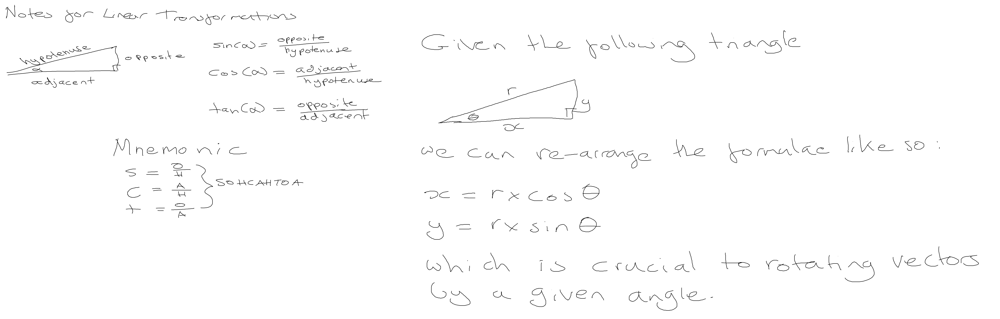

# Course Notes

## Notes

## Formulae

### Rotation of a vector

Given that:

$$
cos(\alpha) = \dfrac{x}{r}
$$

$$
\therefore x = r \cdot cos(\alpha)
$$

And:

$$
sin(\alpha) = \dfrac{y}{r}
$$

$$
\therefore y = r \cdot sin(\alpha)
$$

then rotating a vector $[x, y]$ from angle $\alpha$ to angle $\beta$ yields the following transformed vector $[x^\prime, y^\prime]$ where:

$$
x^ \prime = x \cdot cos(\beta) - y \cdot sin(\beta)
$$

$$
y^ \prime = y \cdot cos(\beta) + x \cdot sin(\beta)
$$

## Triangles and Meshes

A mesh is an arrangment of trianges in 3D space to create the impression of a solid object. Triangles are defined by three corner point vertices which also defines the triangle's face. The order of the vertices that defines the triangle matters -- a clockwise orientation determines what is the face's front and back.

## Additional resources

* [Markdown and LaTeX introduction](https://ashki23.github.io/markdown-latex.html)
* [Mathjax newline issue (Github rendering related)](https://github.com/mathjax/MathJax/issues/2312)
